# Active-Directory-Lab
Active Directory Lab – Project Walkthrough

# Active Directory Overview

## 🔐 What is Active Directory?

**Active Directory (AD)** is a directory service developed by Microsoft, designed to streamline the management of IT infrastructure in medium and large-scale organizations. Its core function is to provide a **centralized, secure, and manageable** way to control all digital resources within an organization.

### 🏢 Why Use Active Directory in Corporate Environments?

Managing hundreds of users, computers, printers, and servers manually is a daunting task. Active Directory simplifies this by enabling:

- Centralized management of users and groups
- Configuration of password policies and security settings
- Application of uniform configurations across network computers
- Control of access permissions
- Regulation of resource access (e.g., who can access shared files?)

### 🧱 Core Components

1. **Domain**: A logical structure grouping all users and resources, managed via a domain name (e.g., `example.com`).
2. **Domain Controller (DC)**: The server hosting the AD database and handling authentication.
3. **Organizational Units (OU)**: Subfolders for organizing users, groups, and computers, used for policy management.
4. **Group Policy**: Tools for centrally enforcing policies, from desktop settings to software deployments.
5. **LDAP (Lightweight Directory Access Protocol)**: The protocol used for AD communication.

### 👥 User Management

AD creates individual user accounts, enabling:

- Secure login to company computers
- Access to file servers
- Connection to printers
- Authorized use of integrated systems like email

### 🔐 Security Benefits

- Restricts access to authorized resources only
- Centralizes firewall and password policy enforcement
- Detects and blocks unauthorized access attempts

---

🔍 Overview
This project involves setting up a virtual Active Directory (AD) environment using Windows Server 2022 and Windows 10 clients. The goal is to simulate a real-world enterprise domain environment, understand authentication, user/group management, and basic Group Policy Objects (GPOs).

Tools & Technologies Used
VirtualBox
Windows Server 2022 ISO
Windows 10 ISO
Active Directory Domain Services (AD DS)
DNS
Group Policy Management Console (GPMC)

# Active Directory Lab

🎯 **Project Objective**  
This project aims to create a virtual Active Directory Domain environment using **Windows Server 2022** and **Windows 10 Client** machines. The objective is to simulate enterprise-level **identity management**, **user/group administration**, **DNS/DHCP configuration**, and **Group Policy** implementation.

---

## 🛠️ Tools & Technologies Used
- **VirtualBox**
- **Windows Server 2022 ISO**
- **Windows 10 ISO**
- **Active Directory Domain Services (AD DS)**
- **DNS / DHCP Server**
- **Group Policy Management Console (GPMC)**

---

## ⚙️ Server Setup and Domain Controller Configuration
1. Created a virtual machine in **VirtualBox** using the **Windows Server 2022 ISO**.
   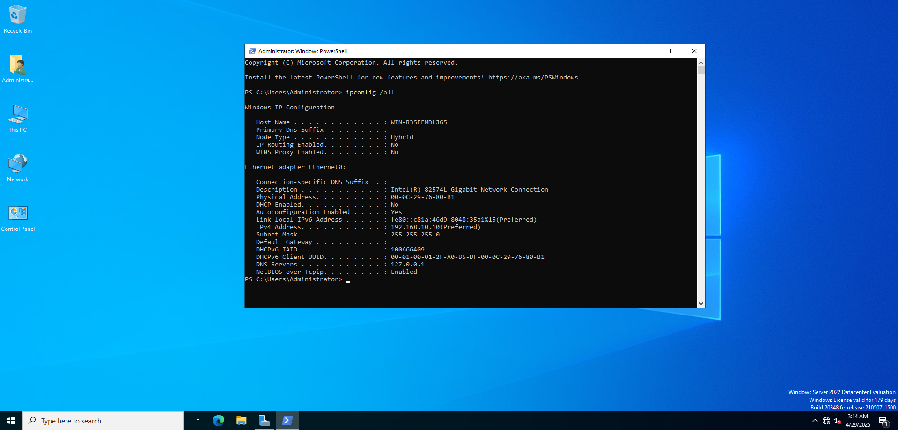
2. Assigned a **static IP address** to the server.
   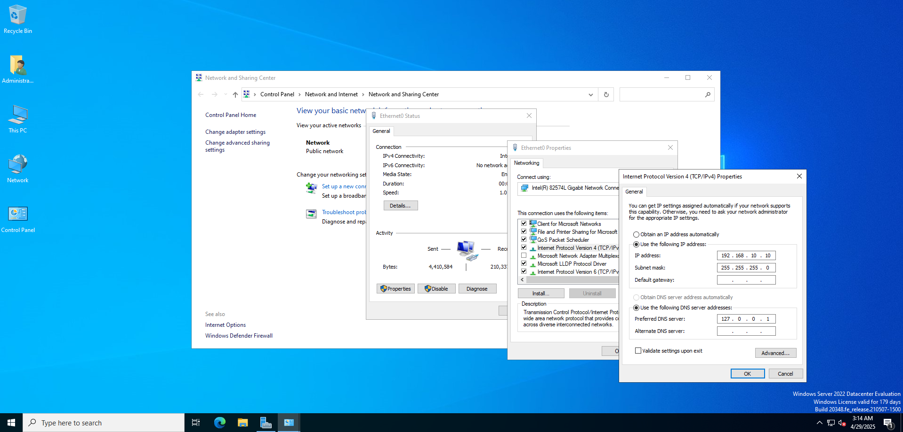
3. From **Server Manager**:
   - Navigated to **Manage > Add Roles and Features**.
   - Installed the **Active Directory Domain Services (AD DS)** role.
   - 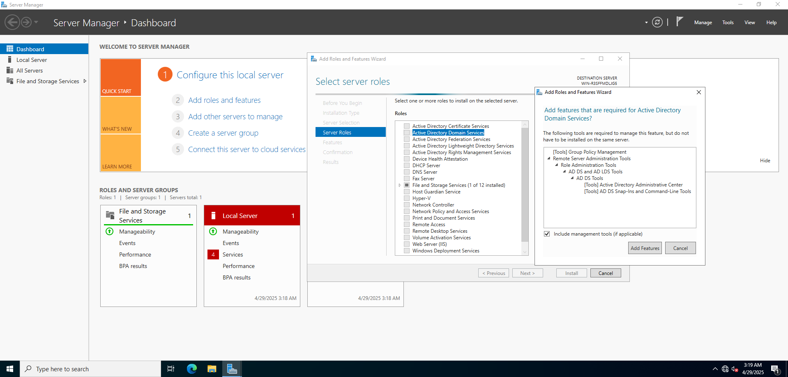
   - Promoted the server to a **Domain Controller**.
4. Created a new forest and domain: **kaanlab.local**.
   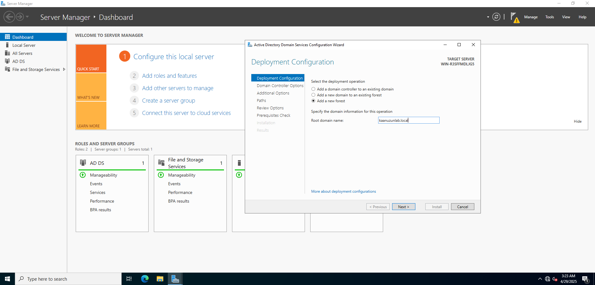
5. Completed setup with default options and defined the **DSRM password**.
   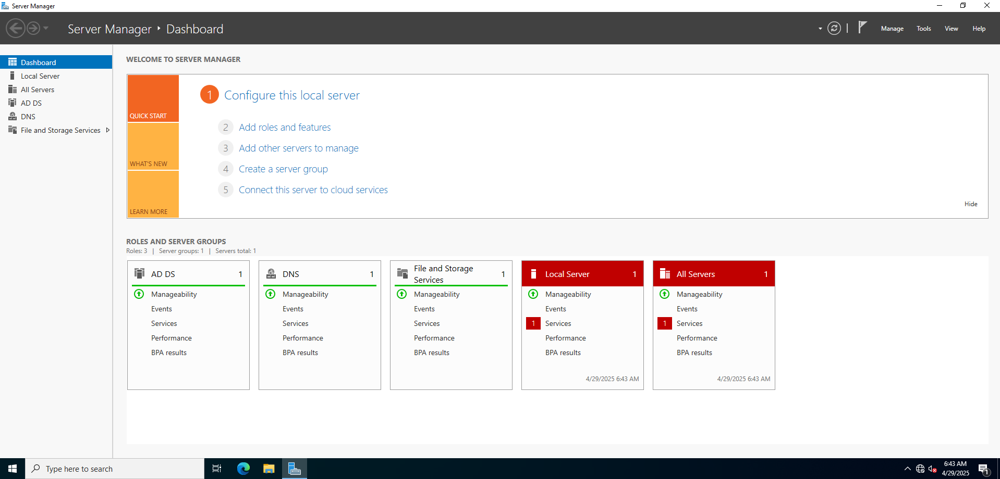
6. **DNS configuration** was automatically handled (Forward Lookup Zone).
7. Manually created a **Reverse Lookup Zone** using the server IP address.
8. Installed the **DHCP Server** role and created a new **IPv4 Scope** for IP distribution.
   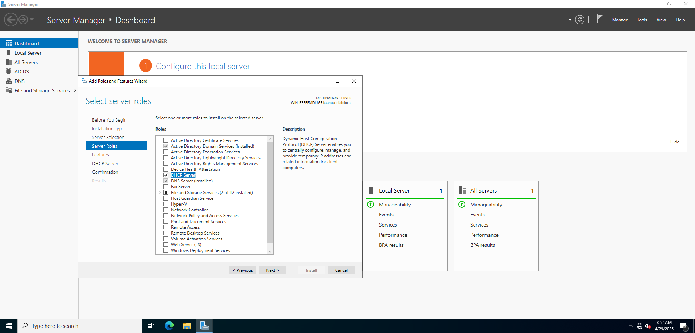
   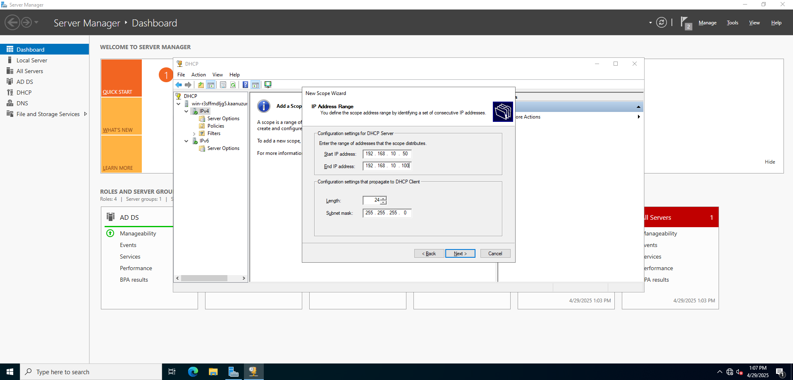

---

## 🧩 Joining the Client Machine to the Domain
1. Created a second VM using **Windows 10** on the same virtual network.
   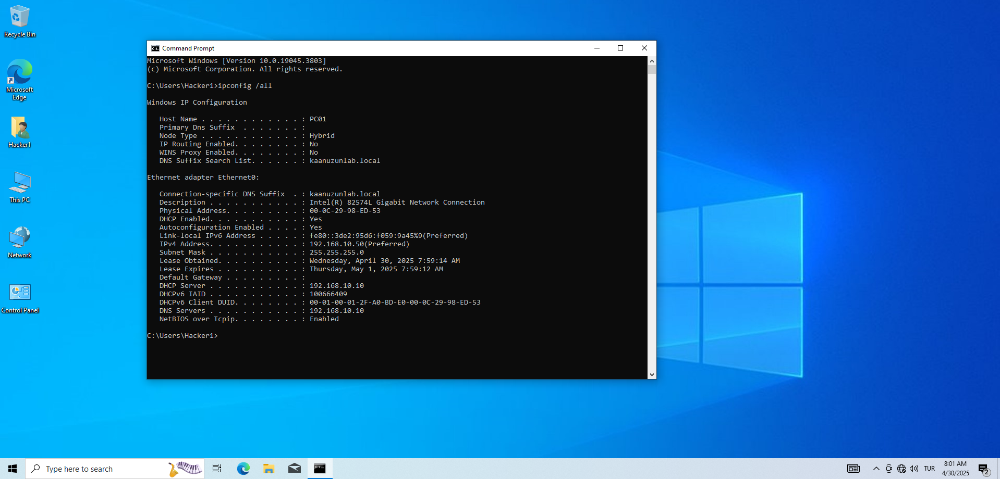
3. Verified network settings with `ipconfig /all`, ensuring correct **DNS** and **DHCP** configurations.
4. Pinged the server to confirm network connectivity.
5. Joined the domain **kaanlab.local** via:
   - **This PC > System Properties > Domain**.
   - Entered **domain administrator credentials**.
6. Successfully logged into the client machine using a domain account.
  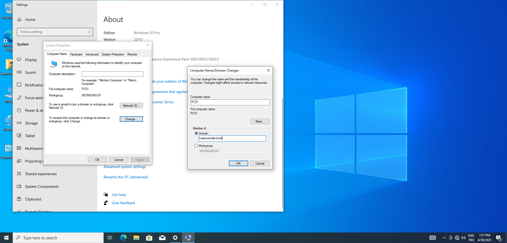

---

## 👤 User and Group Management
1. Created a new group (e.g., **IT_Department**) within the domain structure.
2. Created a new user (e.g., **kaan.uzun**) and assigned them to the group.
3. Logged into the domain-joined client using the new user credentials.
   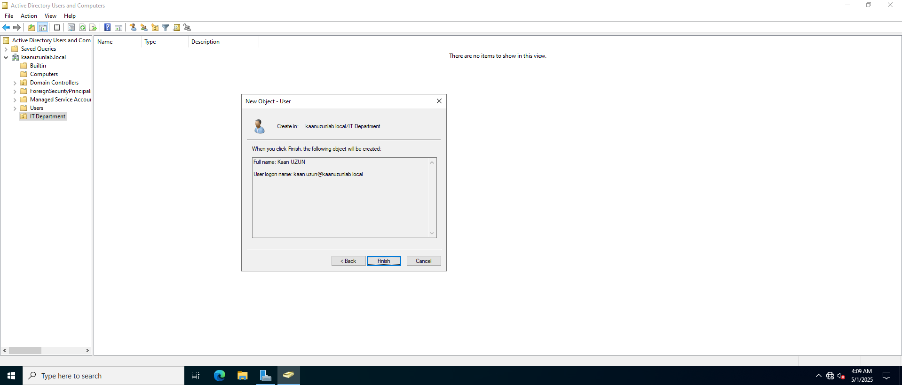

---

## 🛡️ Group Policy Management
1. Opened the **Group Policy Management Console**.
2. Created a new **Group Policy Object (GPO)** and linked it to the domain.
3. Configured a sample **wallpaper policy** under **User Configuration** settings.
4. Applied the policy and updated the client using `gpupdate /force`.
5. Verified successful policy enforcement on the client machine.
   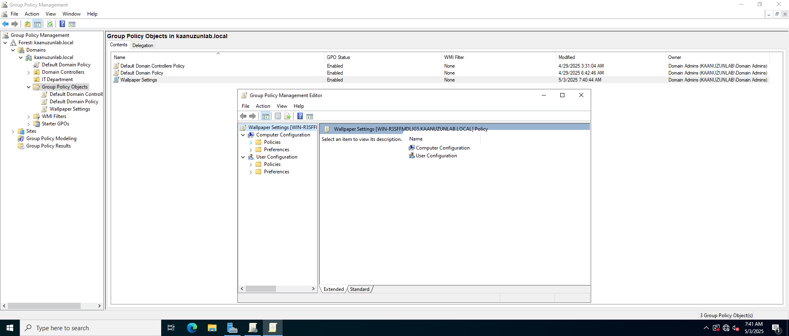
   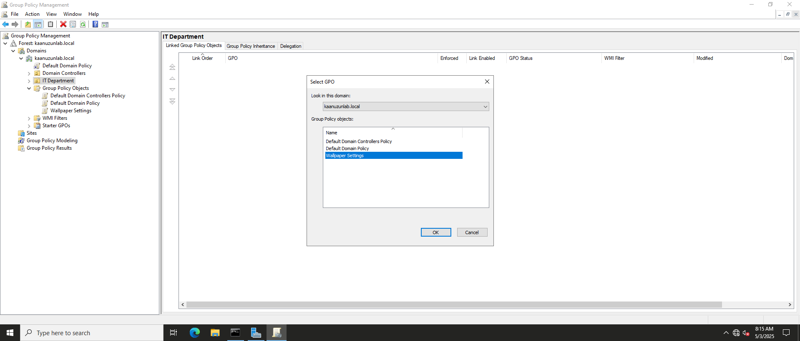

---

## 🚀 Key Takeaways
- Successfully built and managed an **Active Directory infrastructure** from scratch.
- Gained insight into how **domain controllers** handle authentication and group policies.
- Practiced **DNS**, **DHCP**, and **GPO** configurations in a simulated enterprise network.
- Developed hands-on experience in **user/group creation** and **domain administration**.

---
